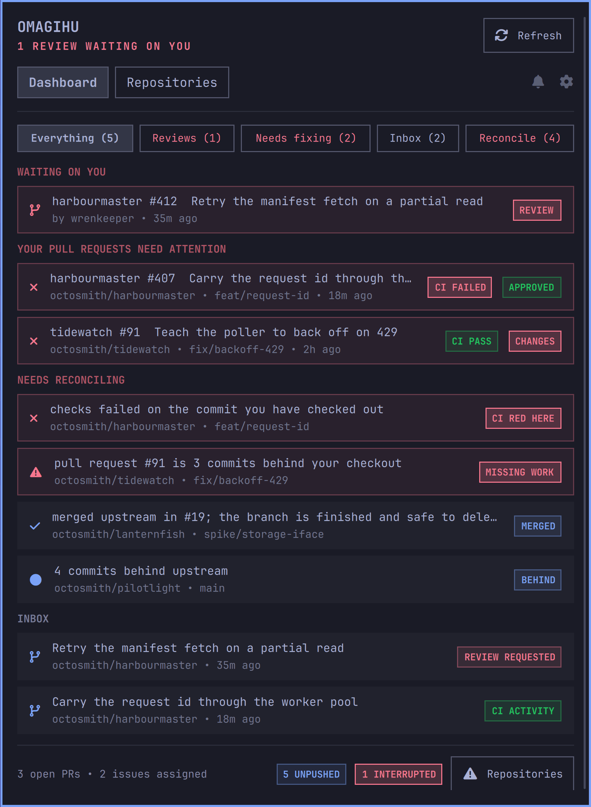

# Omagihu

> **oma·gi·hu** *(n.)*: Omarchy, git, hub. Three syllables borrowed from the
> three things it stands between.
>
> A repository widget answers "what is dirty on this disk". Useful, and not the
> question a developer actually wakes up with. That one is: **is anything
> waiting on me?**
>
> So the account is the spine here, not the filesystem. A repository you have
> never cloned still matters, because somebody can open an issue on it this
> morning. Your local checkouts are annotations on that, not the point of it.

A GitHub mark for the [Omarchy](https://omarchy.org/) bar. Click it and the
first thing you see is what is blocked on you: reviews somebody is waiting for,
then your own pull requests that failed their checks or came back with changes
requested, then the inbox. Under that, what is in flight, and what only exists
on this machine.

The mark lights up when somebody needs you, and stays dark when they do not.
Exactly one tier is ever shown, the most severe one that is actually active. A
badge that is permanently lit is a badge nobody reads.



Everything comes from your own GitHub account over its own API, with a token
that only reads, and from git itself.

## Install

```bash
omarchy plugin add https://github.com/karamble/omarchy-omagihu.git --enable
cd ~/.config/omarchy/plugins/karamble.omagihu && make
bin/omagihu-setup install
```

**The last two lines matter.** No binaries are shipped here, so the three small
Go helpers are compiled on your own machine. It needs Go 1.24 or newer and
builds nothing else. `install` then seeds your first account from the `gh` CLI,
writes a systemd user unit and starts the daemon, so it comes back at every
login. The panel tells you plainly if you skip either step, rather than sitting
on "connecting" for ever.

Then open the panel. That is the whole setup.

`omarchy plugin add` clones the folder and nothing else: it runs no build step
and starts no service, because Omarchy's plugin commands deliberately execute
nothing from a plugin. That is why the last two lines exist. If you skip them
the panel says so and offers to run them for you.

## Updating

```bash
omarchy plugin update karamble.omagihu
cd ~/.config/omarchy/plugins/karamble.omagihu && make && ./bin/omagihu-setup install
```

The update is a git pull inside the plugin folder. The binaries are built
locally, so the second line is needed every time: it rebuilds them and restarts
the service onto what it just built.

## Accounts

Got more than one GitHub identity? A personal one and a work one, say. Omagihu
holds as many as you like and merges them, so a repository visible to both
appears once, with every row knowing which account it came from.

```bash
bin/omagihu-setup add --host github.com   # token is read from stdin, never argv
bin/omagihu-setup list                    # what is stored, secrets redacted
bin/omagihu-setup status                  # is the service up?
```

GitHub Enterprise works too: pass its host and the API roots follow.

## The off switch

Settings carries the polling rhythm as chips: **1m, 5m, 15m, 60m and Off**.

Off is a real kill switch, enforced in the daemon rather than the panel. While
it is off no request leaves the machine, no repository is inspected, no git
process is spawned and nothing is announced. The bar mark goes grey, the panel
keeps the last snapshot and says plainly that it is asleep. The choice is
remembered, so a daemon restarted while asleep comes back asleep.

```bash
bin/omagihu sleep       # stop everything
bin/omagihu every 15    # poll every 15 minutes, waking if asleep
```

## Notifications

Four domains, each switched on its own, because a notifier that fires at
everything gets muted and then the useful ones are lost with it.

| Domain | Default | Speaks when |
|--------|---------|-------------|
| Reviews | on | Somebody requests your review |
| Broken | on | Your pull request fails its checks or is sent back |
| Inbox | off | Anything at all lands in your GitHub inbox |
| Local | off | A rebase or merge is left half finished here |

Only transitions are announced. A standing failure is reported once, not every
twenty seconds, and a restart never replays what you already knew.

## Rate discipline

The whole remote plane costs about five account-scoped requests per cycle,
**regardless of how many repositories you have**. Notifications use conditional
requests: when nothing changed GitHub answers 304, which costs nothing at all
against the rate limit, and its `X-Poll-Interval` is honoured whenever it asks
for a slower cadence. Pull requests, reviews and assignments arrive together in
one batched GraphQL query.

Watching 73 repositories and two accounts for an hour barely moves the meter.

## Ask your agent instead

Omagihu speaks [MCP](https://modelcontextprotocol.io), served by the same daemon
on the same loopback listener, behind the same bearer token. Switch it on in
Settings and print the entry:

```bash
bin/omagihu-setup mcp
```

Paste that into `~/.claude.json` and your coding agent can answer "what is
uncommitted across all my repos", "is anything waiting on me", or "did demarchy's
CI pass" without shelling out and guessing. Six tools read:
`omagihu_attention`, `omagihu_inbox`, `omagihu_work`, `omagihu_repos`,
`omagihu_risk` and `omagihu_facts`. Every answer says whether the daemon was
awake, so an agent never passes stale data off as current.

Three more let an agent wait for something rather than keep looking:
`omagihu_catalogue` says what can be watched, `omagihu_alerts` says what already
is, and `omagihu_agents` says who can be woken. `omagihu_arm`, `omagihu_edit`
and `omagihu_disarm` change those watches. They write to omagihu's own trigger
store and to nothing else: no agent instructions are installed anywhere, and
arming a watch never touches GitHub or a repository.

The bearer token can be recycled from Settings at any time, with a button to
copy it or the whole config entry straight to the clipboard.

## Wake me when

Everything above is a thing you notice when you look. An alert is the other
half: a standing question put to the daemon, which rings when the answer
changes and then stops bothering you.

Arm one from the bell in the panel, or from the command line:

```bash
bin/omagihu-setup catalogue
bin/omagihu-setup arm work.reviewRequests appears --expires 7d --standing \
  --reason "a review landing blocks the release branch"
bin/omagihu-setup arm facts appears --where kind=ci-red-on-head \
  --deliver repo --expires 4d --reason "read the failing job before pushing"
```

Nineteen watchable paths, six operators. `appears` and `disappears` on any
list, `count` and `crosses` on any number, `becomes` on any status, and `ages`
for the one thing a count cannot say: that a single pull request has gone quiet.

An alarm goes to a herdr agent, to whichever agent is working inside the
checkout it concerns, or to your desktop. It carries the condition, the time and
the reason you wrote, and **no values** — whoever is woken reads omagihu itself
through the MCP tools. Alerts observe and ring; nothing is pushed, merged,
closed or marked read because one fired.

Four rules keep it from becoming noise: the first sample never fires, a missing
sample is not a transition, nothing fires while monitoring is off, and every
watch must carry an expiry, because nothing stays armed for ever.

## What it watches locally

Configurable roots, `~/go/src` and `~/Projects` among the defaults. fsnotify
reacts to git operations the instant they happen, so there is no scan budget and
no repository cap. A timer sweeps for working tree edits, which never touch
`.git`.

Three signals the usual repo widget does not have:

- **Unpushed commits.** Not "ahead of upstream", but commits reachable from HEAD
  and from no remote at all: work that exists only on this machine. A repository
  with no remote is never flagged, because there is nowhere to push it.
- **Interrupted operations.** A half finished rebase, an unresolved merge, a
  bisect still running. The states you find weeks later by accident.
- **Fork divergence.** How far behind upstream your fork has drifted, without
  going to look.

## Removal

`omarchy plugin remove` deletes the plugin folder but knows nothing about a user
service, so take that down first. Removing in this order leaves nothing behind:

```bash
cd ~/.config/omarchy/plugins/karamble.omagihu
bin/omagihu-setup uninstall            # stop and remove the service
bin/omagihu-setup uninstall --purge    # ...and delete the stored tokens too
omarchy plugin remove karamble.omagihu --yes
```

Remove the folder first and the service is left pointing at a binary that is no
longer there. It will not run: the unit carries a `ConditionPathExists` on the
daemon, so a removed plugin simply stops starting rather than failing at every
login. The unit file itself stays until `uninstall` takes it away, so it is
worth doing in the order above.

Updating is gentler: `omarchy plugin update` fetches and resets, so `bin/` is
left where it is. The binaries are then older than the source beside them, which
is what the second line of **Updating** is for. Running `omarchy plugin add`
again over an existing install is the harsh one: it clones afresh and the
helpers go with the old folder, so rebuild after that too.

## Read only, on purpose

Omagihu opens things. It never changes them. No pushing, no branch deletion, no
marking notifications read, nothing written to a remote or to your history, and
nothing written outside its own directory: it installs no instructions for your
coding agents and touches no configuration but its own.

The only things it writes are its own: the account store, the settings, and the
watches you or an agent arm. An alert observes and rings. Acting on the reason
stays your job, which is also what keeps the wake-up free of values.

## Licence

ISC. See [LICENSE](LICENSE).
